# 👋 Olá, eu me chamo Camilo!

## 🚀 Desenvolvedor Full Stack

Sou um desenvolvedor apaixonado por tecnologia e inovação, com experiência em criar soluções completas do front-end ao back-end. Sempre em busca de novos desafios e aprendizados!

---

## � Estatísticas do GitHub

  
  

  📅 <b>Ano Atual (2026)</b> &nbsp;&nbsp;&nbsp;&nbsp;&nbsp;&nbsp;&nbsp;&nbsp;&nbsp;&nbsp;&nbsp;&nbsp;&nbsp;&nbsp;&nbsp;&nbsp;&nbsp;&nbsp;&nbsp;&nbsp;&nbsp;&nbsp;&nbsp;&nbsp;&nbsp;&nbsp;&nbsp;&nbsp;&nbsp;&nbsp;&nbsp;&nbsp; 📈 <b>Todos os Anos</b>

---

## �💻 Tecnologias e Ferramentas

### Front-end

### Back-end

### Banco de Dados

### DevOps & Ferramentas

---

## 🎯 Sobre Mim

- 🔭 Atualmente trabalhando como desenvolvedor front-end
- 🌱 Sempre aprendendo novas tecnologias e frameworks
- 👯 Aberto a colaborações em projetos interessantes
- 💬 Pergunte-me sobre desenvolvimento web, APIs e arquitetura de software
- ⚡ Fato curioso: Apaixonado por resolver problemas complexos

---

## 📫 Curriculo e Certificados

